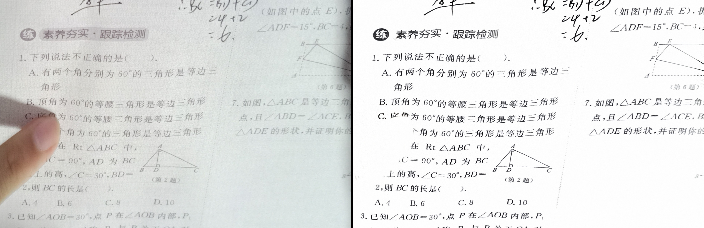
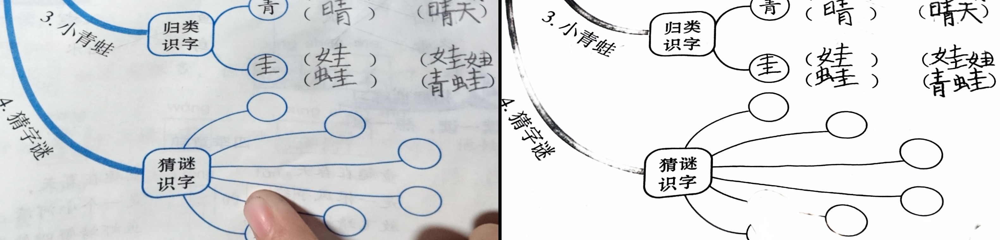
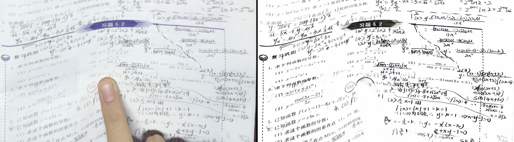

## 简介
这是一个基于PyTorch Lightning构建的文档矫正与文档增强的训练框架，用于复现各种文档矫正与增强的论文，以及一些属于自己的创新.  

    

    

    

## 主要特性
- 使用 PyTorch Lightning 构建，代码结构清晰
- 支持 Weights & Biases (wandb) 实验跟踪
- 灵活的配置系统，支持 YAML 配置和命令行参数
- 支持模型断点保存和恢复
- 支持混合精度训练
- 自动记录训练指标

## 项目结构
- `README.md`：项目的总体说明文档。
- `models/`：包含模型文件。
- `tools/`：包含数据集、LightningModule构建、Loss函数定义等
  - `datasets/`：数据集处理
  - `losses/`：自定义loss
  - `pl_tools/`：LightningModule构建
- `test_dir/`：用于存放测试数据与输出内容。
- `train_*.py`：用于启动训练
- `predict_*.py`：用于推理 custom data
- `export_*.py`：用于转换ONNX
- `configs/config.md`：[config.md](configs/config.md)

## 待办事项清单
- [x] 上传增强模型推理结果与测试样例原图
- [x] 新增模糊增强与噪音增强(enhancement任务)
- [ ] 新增export_retinexformer.py 和 export_geotr.py
- [ ] 新增复现的原文链接与原代码链接
- [ ] 新增百度商业接口与本文SOTA(drnet_gdx)的对比结果

## 已有方法
| **方法名称** | **配置文件** | **数据集** | **备注** | **任务类型** |
| --- | --- | --- | --- | --- |
| DocTr++ | config_geotr_Doc3D.yaml | Doc3D | <ul><li>已完成</li></ul> | dewarp |
| IllTr from DocTr | config_illtr_Inv3D.yaml | Inv3D | <ul><li>由于面对大分辨率图片推理成本过高，后续不再更新</li></ul> | enhancement |
| **drnet_gdx** | config_drnet_doc3dshade.yaml | Doc3dShade | <ul><li>已完成：弃用了原文的gcnet，替换为docres的prompt图片预处理方式</li><li>弃用了TV Loss</li></ul> | enhancement |
| Retinexformer | config_retinexformer_doc3dshade.yaml | Doc3dShade | <ul><li>已完成，但面对模糊图片与某些情况会出现大面空白的情况</li></ul> | enhancement |

